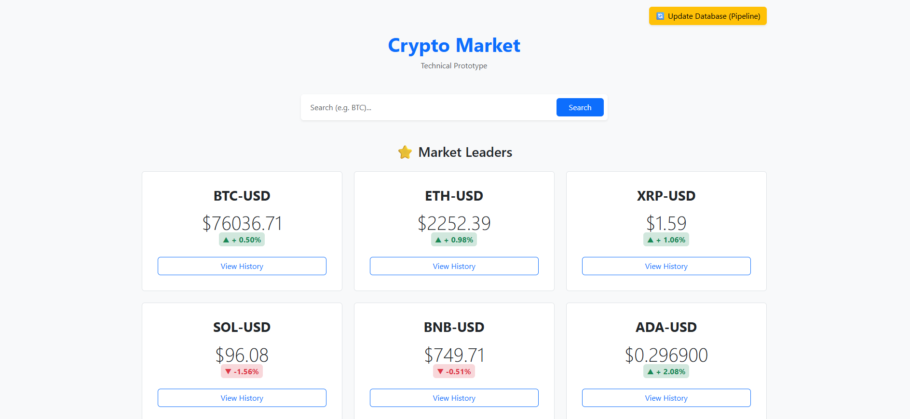
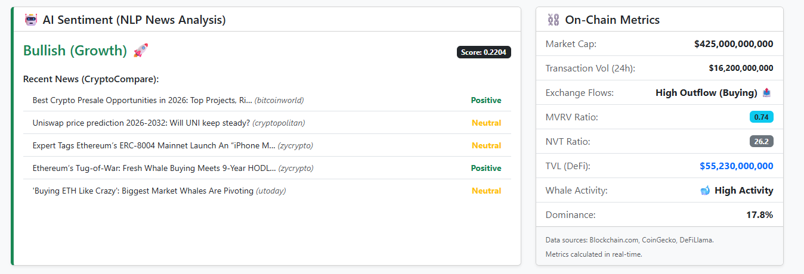

# 📊 CryptoAnalysis Platform

A comprehensive, production-ready cryptocurrency market intelligence platform that combines technical analysis, fundamental analysis, and machine learning to provide traders and investors with real-time market insights across multiple cryptocurrencies.



## 🌐 Live Demo

- **Web Application**: [cryptoanalysis-web.onrender.com](https://cryptoanalysis-web.onrender.com)
- **Technical Analysis API**: [cryptoanalysis-ta.onrender.com](https://cryptoanalysis-ta.onrender.com)
- **Fundamental Analysis API**: [cryptoanalysis-fa.onrender.com](https://cryptoanalysis-fa.onrender.com)
- **LSTM Predictor**: Hosted on [HuggingFace Spaces](https://bojan-spasovski-crypto-lstm-predictor.hf.space)

---

## ✨ Features

### 📈 Technical Analysis
- **9 Advanced Indicators** - RSI, MACD, Bollinger Bands, Stochastic Oscillator, ADX, CCI, SMA, EMA, and Volume Analysis
- **Multi-Timeframe Signals** - 1-day, 1-week, and 1-month trading recommendations (BUY/SELL/HOLD)
- **Interactive Charts** - Real-time price visualization with Chart.js
- **Historical Data** - Access complete OHLCV data with multiple timeframe views (1m, 5m, 15m, 1h, 1d)
- **Detailed Breakdowns** - View raw indicator values and scoring logic for each signal

### 🧠 AI-Powered Predictions
- **LSTM Neural Network** - Deep learning model trained on historical market data
- **Price Forecasting** - Predict future cryptocurrency prices for any date
- **Confidence Metrics** - View prediction accuracy and model performance
- **Interactive Visualization** - Compare predictions against actual price trends

### 📰 Sentiment Analysis
- **NLP-Based Analysis** - Real-time news sentiment using VADER sentiment analyzer
- **Latest News** - Aggregated from CryptoCompare across multiple sources
- **Sentiment Scoring** - Positive, Neutral, or Negative classification for each article
- **Market Prediction** - Overall sentiment prediction: Bullish 🚀, Bearish 📉, or Neutral ⚖️



### ⛓️ On-Chain Metrics
- **Market Dominance** - Real-time market share calculations
- **Transaction Volume** - 24-hour trading volume across exchanges
- **NVT Ratio** - Network Value to Transactions ratio
- **Whale Activity** - Large holder movement detection
- **Exchange Flows** - Inflow/Outflow analysis for price prediction
- **TVL Tracking** - Total Value Locked for DeFi protocols (ETH, SOL, BNB, ADA, AVAX, TRX)
- **Hash Rate** - Bitcoin network security metrics
- **Active Addresses** - Daily blockchain activity monitoring

### 🎯 User Experience
- **10+ Cryptocurrencies** - BTC, ETH, XRP, SOL, BNB, ADA, DOGE, TRX, AVAX, LTC
- **Responsive Design** - Bootstrap-based UI optimized for desktop and mobile
- **Real-Time Updates** - Live price data with automatic refresh
- **Smart Service Management** - Automatic microservice wake-up on free-tier hosting
- **Graceful Degradation** - Fallback data when APIs are rate-limited

---

## 🛠️ Tech Stack

### Frontend
| Technology | Version | Purpose |
|------------|---------|---------|
| Django Templates | 5.2 | Server-side rendering |
| Bootstrap | 5.3 | Responsive UI framework |
| Chart.js | 4.4.0 | Interactive data visualization |
| JavaScript | ES6+ | Dynamic interactions |

### Backend - Web Application
| Technology | Version | Purpose |
|------------|---------|---------|
| Django | 5.2 | Main web framework |
| Gunicorn | 23.0.0 | WSGI production server |
| Pandas | 2.2.0 | Data processing & analysis |
| NumPy | 1.26.3 | Numerical computations |
| Requests | 2.32.3 | HTTP client for API calls |

### Backend - Microservices
| Technology | Version | Purpose |
|------------|---------|---------|
| FastAPI | 0.115.12 | High-performance API framework |
| Uvicorn | 0.34.0 | ASGI server |
| VADER Sentiment | 3.3.2 | NLP sentiment analysis |
| Requests | 2.32.3 | External API integration |

### Machine Learning
| Technology | Version | Purpose |
|------------|---------|---------|
| TensorFlow | 2.18.0 | Deep learning framework |
| Keras | 3.8.0 | Neural network API |
| scikit-learn | 1.6.1 | Data preprocessing |
| Gradio | 5.12.0 | ML model interface |

### Deployment & Infrastructure
| Service | Purpose |
|---------|---------|
| Render | Web app & microservices hosting |
| HuggingFace Spaces | LSTM model deployment |
| GitHub | Version control & CI/CD |

### External APIs
| API | Purpose |
|-----|---------|
| CoinGecko | Market data, prices, market cap |
| CryptoCompare | News & sentiment data |
| Blockchain.com | Bitcoin on-chain metrics |
| DeFiLlama | Total Value Locked (TVL) data |

---

## 🏗️ Architecture

### Microservices Design
```
┌─────────────────┐
│   Web Browser   │
└────────┬────────┘
         │
         ▼
┌─────────────────┐
│  Django Web App │ ◄─── User Interface
│  (Port 10000)   │      Data Aggregation
└────┬─────┬──────┘      Service Orchestration
     │     │
     │     └──────────────────┐
     │                        │
     ▼                        ▼
┌──────────────┐      ┌──────────────────┐
│ Technical    │      │ Fundamental      │
│ Analysis     │      │ Analysis         │
│ Service      │      │ Service          │
│ (FastAPI)    │      │ (FastAPI)        │
└──────┬───────┘      └────────┬─────────┘
       │                       │
       │                       ▼
       │              ┌─────────────────┐
       │              │ External APIs   │
       │              │ - CoinGecko     │
       │              │ - CryptoCompare │
       │              │ - Blockchain.io │
       │              └─────────────────┘
       │
       ▼
┌──────────────────┐
│ LSTM Predictor   │
│ (HuggingFace)    │
└──────────────────┘
```

### Key Design Patterns
- **Service Facade** - Centralized API coordination in `facade.py`
- **Async Wake-Up** - Background thread service initialization
- **Circuit Breaker** - Fallback data when external APIs fail
- **Retry Logic** - Automated request retries with exponential backoff
- **Rate Limiting Handling** - Graceful degradation with cached data

---

## 📋 Prerequisites

Before running locally, ensure you have:

- **Python** 3.10 or higher
- **pip** package manager
- **Git** for version control

Optional:
- **Virtual environment** (venv or conda)
- API keys for enhanced features (CoinGecko Pro, etc.)

---

## ⚡ Local Development Setup

### 1. Clone the Repository
```bash
git clone https://github.com/spasovskibojan/CryptoAnalysis.git
cd CryptoAnalysis
```

### 2. Technical Analysis Service Setup

```bash
cd technical_analysis_service

# Create virtual environment
python -m venv venv

# Activate virtual environment
# Windows:
.\venv\Scripts\activate
# macOS/Linux:
source venv/bin/activate

# Install dependencies
pip install -r requirements.txt

# Start the service
uvicorn main:app --host 0.0.0.0 --port 8001 --reload
```

The Technical Analysis API will be available at: `http://localhost:8001`

### 3. Fundamental Analysis Service Setup

```bash
cd fundamental_analysis_service

# Create virtual environment
python -m venv venv

# Activate virtual environment
.\venv\Scripts\activate  # Windows
source venv/bin/activate  # macOS/Linux

# Install dependencies
pip install -r requirements.txt

# Start the service
uvicorn main:app --host 0.0.0.0 --port 8002 --reload
```

The Fundamental Analysis API will be available at: `http://localhost:8002`

### 4. Web Application Setup

```bash
cd tech_prototype

# Create virtual environment
python -m venv venv

# Activate virtual environment
.\venv\Scripts\activate  # Windows
source venv/bin/activate  # macOS/Linux

# Install dependencies
pip install -r requirements.txt

# Set environment variables (see below)

# Run database migrations
python manage.py migrate

# Start the development server
python manage.py runserver
```

The web application will be available at: `http://localhost:8000`

---

## 🔐 Environment Variables

### Web Application (`tech_prototype/.env` or environment)
```env
SECRET_KEY=your_django_secret_key_here
DEBUG=True
ALLOWED_HOSTS=localhost,127.0.0.1

# Microservice URLs
TA_SERVICE_URL=http://localhost:8001
FA_SERVICE_URL=http://localhost:8002
LSTM_SERVICE_URL=https://your-huggingface-space.hf.space

# Optional: API Keys for enhanced limits
COINGECKO_API_KEY=your_coingecko_api_key
```

### Fundamental Analysis Service (Optional)
```env
COINGECKO_API_KEY=your_coingecko_api_key
```

> **Note**: The application works with free-tier APIs. Premium API keys are optional for higher rate limits.

---

## 📂 Project Structure

```
CryptoAnalysis/
├── tech_prototype/                    # Main Django Web Application
│   ├── web/
│   │   ├── views.py                   # View controllers
│   │   ├── facade.py                  # Service orchestration & wake-up logic
│   │   ├── templates/
│   │   │   ├── index.html             # Homepage with coin list
│   │   │   └── detail.html            # Detailed coin analysis page
│   │   └── static/                    # CSS, JS, images
│   ├── tech_prototype/
│   │   ├── settings.py                # Django configuration
│   │   └── urls.py                    # URL routing
│   ├── data/                          # Historical price data (JSON)
│   ├── manage.py
│   └── requirements.txt
│
├── technical_analysis_service/        # FastAPI Microservice
│   ├── main.py                        # TA indicators & signals
│   ├── requirements.txt
│   └── README.md
│
├── fundamental_analysis_service/      # FastAPI Microservice
│   ├── main.py                        # Sentiment & on-chain analysis
│   ├── requirements.txt
│   └── README.md
│
├── lstm_service/                      # LSTM Prediction Model
│   ├── app.py                         # Gradio interface
│   ├── predictor.py                   # LSTM implementation
│   ├── data/                          # Training data
│   ├── models/                        # Saved model cache
│   └── requirements.txt
│
├── screenshots/                       # README images
└── README.md
```

---

## 🎯 Usage Guide

### Viewing Market Overview
1. Navigate to the **homepage** to see all tracked cryptocurrencies
2. View real-time prices and 24-hour percentage changes
3. Click **"View History"** on any coin to see detailed analysis

### Analyzing a Cryptocurrency
1. Select a cryptocurrency from the homepage
2. **Technical Signals**: View BUY/SELL/HOLD recommendations for different timeframes
3. **Price Chart**: Analyze trends with SMA and EMA overlays
4. **Indicators**: See detailed breakdowns of all 9 technical indicators
5. **Sentiment**: Read latest news and overall market sentiment
6. **On-Chain**: Monitor blockchain metrics and whale activity

### AI Price Prediction
1. On the coin detail page, scroll to **"AI-Powered Price Prediction"**
2. Select a cryptocurrency from the dropdown
3. Choose a future date for prediction
4. Click **"Predict Price"** to generate forecast
5. View prediction chart with confidence intervals

### Changing Timeframes
- Use the **timeframe selector** (1m, 5m, 15m, 1h, 1d) to analyze different granularities
- Technical signals automatically update based on selected timeframe

---

## 🔧 Advanced Features

### Intelligent Service Wake-Up
The platform implements a sophisticated wake-up system for services hosted on free-tier infrastructure:
- **Automatic Detection**: Detects when microservices are sleeping
- **Parallel Wake-Up**: Triggers both TA and FA services simultaneously
- **Health Monitoring**: Verifies service readiness before proceeding
- **User Feedback**: Displays status banners during wake-up process

### Fallback Mechanisms
- **Rate-Limit Recovery**: Switches to cached/estimated data when APIs are rate-limited
- **Service Redundancy**: Continues operation even if individual APIs fail
- **Historical Fallbacks**: Uses recent data when live APIs are unavailable

### Performance Optimizations
- **Model Caching**: LSTM models are cached for 24 hours to reduce training time
- **Concurrent Requests**: Parallel API calls to minimize latency
- **Data Preprocessing**: Pre-calculated indicators stored for faster rendering

---

## 📊 Supported Cryptocurrencies

| Symbol | Name | Technical Analysis | Fundamental Analysis | LSTM Prediction |
|--------|------|:------------------:|:--------------------:|:---------------:|
| BTC-USD | Bitcoin | ✅ | ✅ | ✅ |
| ETH-USD | Ethereum | ✅ | ✅ | ✅ |
| XRP-USD | Ripple | ✅ | ✅ | ✅ |
| SOL-USD | Solana | ✅ | ✅ | ✅ |
| BNB-USD | Binance Coin | ✅ | ✅ | ✅ |
| ADA-USD | Cardano | ✅ | ✅ | ✅ |
| DOGE-USD | Dogecoin | ✅ | ✅ | ✅ |
| TRX-USD | Tron | ✅ | ✅ | ✅ |
| AVAX-USD | Avalanche | ✅ | ✅ | ✅ |
| LTC-USD | Litecoin | ✅ | ✅ | ✅ |

---

## 👨‍💻 Author

**Bojan Spasovski**

- GitHub: [@spasovskibojan](https://github.com/spasovskibojan)
- LinkedIn: [Bojan Spasovski](https://www.linkedin.com/in/bojan-spasovski)

---

## 🙏 Acknowledgments

- **CoinGecko** - Market data API
- **CryptoCompare** - News and sentiment data
- **Blockchain.com** - Bitcoin on-chain metrics
- **DeFiLlama** - DeFi TVL data
- **Render** - Cloud hosting platform
- **HuggingFace** - ML model deployment
